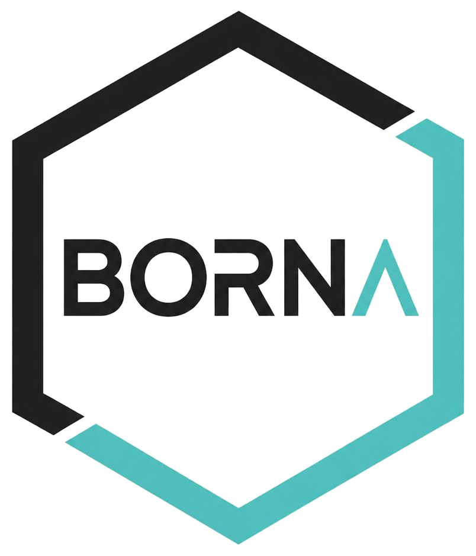

# BORNA

<p align="center">
  
</p>

<p align="center">
  <strong>BOolean network two-node dynamics via state-tRansition graph aNalysis</strong>
</p>

<p align="center">
  An interactive explorer of two-node Boolean network dynamics and state-transition graphs.
</p>

**BORNA** is an interactive web application and computational resource for exploring two-node signed Boolean networks and their state-transition graph (STG) dynamics. It was developed as a companion to the associated research study and provides interactive access to the complete catalogue of two-node Boolean-network realizations and their dynamical behaviors under both synchronous and asynchronous updating.

The repository also contains the analysis code and generated results underlying the network enumeration and dynamical analyses reported in the study.

## Online Application

The latest version of BORNA is available at:

**https://jafarilab.github.io/BORNA/**

The application runs directly in a web browser and requires no installation or external dependencies.

## Running the Application Locally

To run BORNA locally, clone or download this repository and open:

```text
index.html
```

No server, Python environment, package manager, or additional installation is required.

## Features

BORNA provides two exploration modes:

* **89 presets** — the ordered 89 Boolean-network realizations analyzed in the study.
* **Custom rules** — direct selection of Boolean rules for `A'` and `B'`.

For each selected network/rule pair, the application displays:

* the corresponding signed regulatory network;
* the Boolean update rules for nodes `A` and `B`;
* the synchronous and BoolNet-style asynchronous truth tables;
* the corresponding state-transition graph;
* terminal SCCs and attractor states;
* optional self-loops.

## Synchronous Dynamics

Under synchronous updating, both nodes are updated simultaneously:

```text
(A, B) -> (A'(A,B), B'(A,B))
```

For a two-node Boolean network, the state space consists of four possible states:

```text
00, 01, 10, 11
```

Each state therefore has exactly one synchronous successor, resulting in a deterministic state-transition graph.

## Asynchronous Dynamics

BORNA also supports one-node-at-a-time asynchronous updating. From a given state, either node can be updated:

```text
A-only: (A, B) -> (A'(A,B), B)
B-only: (A, B) -> (A, B'(A,B))
```

This produces a potentially nondeterministic state-transition graph in which a state may have more than one possible successor.

Terminal strongly connected components (SCCs) are used to identify terminal dynamical structures in the asynchronous STG.

## Self-Loops

BORNA provides a **Show self-loops** option.

When the option is disabled, self-loops are hidden whenever a state has at least one non-self outgoing asynchronous transition. Self-loops are retained when no non-self asynchronous transition is available, preserving fixed-point states while reducing unnecessary visual clutter.

## The 89-Network Catalogue

The **89 presets** represent the ordered Boolean-network realizations systematically enumerated and analyzed in the accompanying study. Each realization is associated with its signed regulatory structure, Boolean update rules, and corresponding synchronous and asynchronous dynamics.

The catalogue allows users to examine how different network structures and Boolean rules give rise to distinct or shared state-transition graphs and attractor behaviors.

## Repository Structure

```text
.
├── index.html
├── app.js
├── styles.css
├── logo-transparent.png
├── logo.jpeg
├── README.md
└── BORNA_GITHUB_FINAL_CODE/
    ├── BORNA_GITHUB_FINAL_RESULTS/
    ├── README.md
    ├── borna_generate_final_outputs.py
    └── requirements.txt
```

### Web Application

* `index.html` — main BORNA application interface.
* `app.js` — Boolean-network logic, STG generation, and interactive visualization.
* `styles.css` — application styling and layout.
* `logo-transparent.png` — BORNA logo used by the web application.
* `logo.jpeg` — additional BORNA logo image.

### Analysis and Reproducibility

The `BORNA_GITHUB_FINAL_CODE/` directory contains the computational code and results associated with the analysis reported in the study.

* `borna_generate_final_outputs.py` — Python workflow for generating the final analysis outputs.
* `requirements.txt` — Python package dependencies required to run the analysis code.
* `BORNA_GITHUB_FINAL_RESULTS/` — generated results and supporting outputs from the computational analysis.
* `README.md` — documentation for the analysis and reproducibility workflow.

## Reproducing the Analysis

The analysis code is provided in:

```text
BORNA_GITHUB_FINAL_CODE/
```

To install the required Python dependencies:

```bash
cd BORNA_GITHUB_FINAL_CODE
pip install -r requirements.txt
```

The main analysis workflow can then be executed with:

```bash
python borna_generate_final_outputs.py
```

Please refer to the README within `BORNA_GITHUB_FINAL_CODE/` for additional information about the analysis workflow, input files, generated outputs, and directory structure.

## Data and Code Availability

The complete two-node Boolean-network catalogue, analysis code, generated results, and BORNA web application source code are available at:

**https://github.com/jafarilab/BORNA**

The repository provides the computational resources required to reproduce the network enumeration and synchronous and asynchronous STG analyses reported in the study, as well as the interactive application for exploring the resulting network catalogue.

## Research Context

BORNA was developed as a companion resource for the associated research study:

> **Reducing Boolean Networks via Analysis of Dynamic Network Subgraph Behavior**

The application and computational resources are intended to support exploration, reproducibility, and further development of behavior-based approaches to Boolean network dynamics.

## Citation

If you use **BORNA**, the associated network catalogue, or the analysis code in your research, please cite:

> Zakeri, S., & Jafari, M. (2026). **Reducing Boolean Networks via Analysis of Dynamic Network Subgraph Behavior.** *arXiv preprint arXiv:2608.19292*. https://doi.org/10.48550/arXiv.2608.19292

## License

CC BY-NC-ND

## Contact

For questions, suggestions, or issues related to BORNA, please open an issue in this repository or contact the authors through the information provided in the accompanying publication.
