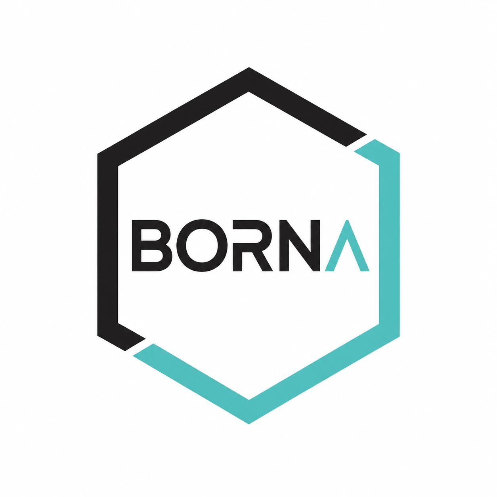

# BORNA — BOolean network two-node dynamics via state-tRansition graph aNalysis

<p align="center">  </p>

<p align="center"> <strong>An interactive explorer for two-node Boolean networks and state-transition graph dynamics.</strong> </p>

**BORNA** is an interactive web application for exploring two-node signed Boolean networks and their state-transition graph (STG) dynamics. It was developed as a companion tool for the associated research study, providing interactive access to the complete catalogue of two-node Boolean-network realizations and their dynamical behaviors under both synchronous and asynchronous updating.

The application runs directly in a web browser and requires no installation or external dependencies.

## Features

BORNA provides two main exploration modes:

* **89 Presets** — the complete set of 89 Boolean-network realizations analyzed in the study.
* **Custom Rules** — interactive selection of Boolean update rules for nodes (A) and (B).

For each selected network or rule pair, BORNA provides:

* The corresponding signed regulatory network structure.
* The Boolean update rules for (A') and (B').
* Synchronous and asynchronous truth tables.
* The corresponding state-transition graphs (STGs).
* Attractor and terminal strongly connected component (SCC) information.
* Interactive visualization of network states and transitions.
* Optional display of self-loops.

## Synchronous Dynamics

For a two-node Boolean network, the state space is

[
S = {00,01,10,11}.
]

Under synchronous updating, both nodes are updated simultaneously according to

[
(A,B) \rightarrow (A'(A,B), B'(A,B)).
]

This produces a deterministic state-transition graph in which every state has exactly one successor.

## Asynchronous Dynamics

BORNA also implements one-node-at-a-time asynchronous updating. From a state ((A,B)), two possible updates are considered:

```text
A-only: (A, B) -> (A'(A,B), B)
B-only: (A, B) -> (A, B'(A,B))
```

Thus, an asynchronous state-transition graph can be nondeterministic, with a state potentially having more than one successor depending on which node is updated.

Terminal strongly connected components (SCCs) are used to characterize the terminal dynamical structures of the asynchronous STG.

## Self-Loops

BORNA provides an option to show or hide self-loops.

When **Show self-loops** is disabled, self-loops are hidden whenever a state has at least one non-self outgoing asynchronous transition. Self-loops are retained when no non-self asynchronous transition is available, preserving fixed-point states while avoiding visually redundant transitions.

## The 89-Network Catalogue

The **89 Presets** correspond to the Boolean-network realizations systematically enumerated and analyzed in the accompanying study. Each realization is associated with its signed regulatory structure, Boolean update rules, and corresponding synchronous and asynchronous dynamical representations.

The catalogue allows users to explore how different network structures and logical rules produce distinct or shared dynamical behaviors.

## Running BORNA

BORNA is a standalone client-side application.

To run it locally:

1. Clone or download this repository.
2. Open `index.html` in a modern web browser.

No server, Python environment, package manager, or additional installation is required.

## Repository Structure

```text
.
├── index.html
├── ...
└── README.md
```

The main application is contained in `index.html` together with the supporting files included in this repository.

## Research Context

BORNA was developed as a companion resource for the study:

> **[Add manuscript title here]**

The application provides an interactive interface for exploring the two-node Boolean-network catalogue, state-transition graphs, attractor structures, and the differences between synchronous and asynchronous updating.

## Citation

If you use BORNA or the associated network catalogue in your research, please cite the accompanying publication:

> **[Add publication citation here]**

## License

[Add license information here.]

## Contact

For questions, suggestions, or issues related to BORNA, please open an issue in this repository or contact the authors through the information provided in the accompanying publication.
